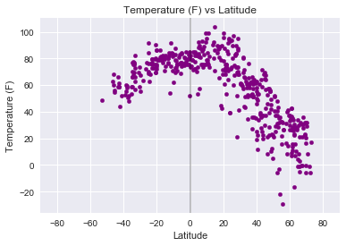
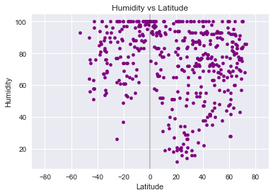
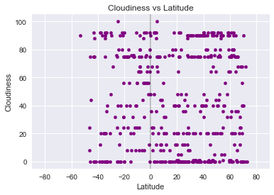
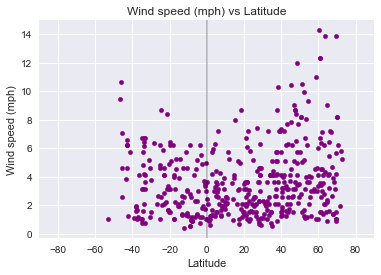

```python
#Observable Trends
    #higher latitudes have higher windspeeds
    #tempature is consistently higher in the souther hemisphere and is steadily decreases the further north of the equator
    #the lower the cloudiness the higher the humidity
```


```python
#Import Dependencies
import pandas as pd
import numpy as np
import random
from config import api_key
from citipy import citipy
import openweathermapy as owm

import matplotlib.pyplot as plt
import matplotlib
plt.style.use("seaborn")

#import requests
```


```python
lat = []
long = []


#generate random number for latitute, range from -90 to 90
for x in range(2000):
    lat.append(random.uniform(-90,90))

#gnerate randome numbers for long, range form -180 to 180
for x in range(2000):
    long.append(random.uniform(-180,180))
    
locations_df = pd.DataFrame({"Latitude": lat, "Longitude": long})
locations_df.head()

```


<div>
<style scoped>
    .dataframe tbody tr th:only-of-type {
        vertical-align: middle;
    }

    .dataframe tbody tr th {
        vertical-align: top;
    }

    .dataframe thead th {
        text-align: right;
    }
</style>
<table border="1" class="dataframe">
  <thead>
    <tr style="text-align: right;">
      <th></th>
      <th>Latitude</th>
      <th>Longitude</th>
    </tr>
  </thead>
  <tbody>
    <tr>
      <th>0</th>
      <td>12.358289</td>
      <td>-149.917143</td>
    </tr>
    <tr>
      <th>1</th>
      <td>53.526634</td>
      <td>-31.542598</td>
    </tr>
    <tr>
      <th>2</th>
      <td>-70.445868</td>
      <td>-133.293850</td>
    </tr>
    <tr>
      <th>3</th>
      <td>-79.522890</td>
      <td>-43.761220</td>
    </tr>
    <tr>
      <th>4</th>
      <td>13.160657</td>
      <td>-113.970853</td>
    </tr>
  </tbody>
</table>
</div>


```python
#Using citipy to get the closest city:

for index,row in locations_df.iterrows():
    city = citipy.nearest_city(row["Latitude"],row["Longitude"])
    locations_df.set_value(index,"City",city.city_name)
    locations_df.set_value(index,"Country code",city.country_code)

#Dropping the lat and long column from the dataframe (not the actual coordinates of the cities)
clean_locations_df = locations_df.drop(['Latitude', 'Longitude'],axis=1)

#Dropping duplicate any cities in dataframe
clean_locations_df = clean_locations_df.drop_duplicates()

clean_locations_df.head()
```

    /Users/annabower/anaconda3/lib/python3.6/site-packages/ipykernel_launcher.py:5: FutureWarning: set_value is deprecated and will be removed in a future release. Please use .at[] or .iat[] accessors instead
      """
    /Users/annabower/anaconda3/lib/python3.6/site-packages/ipykernel_launcher.py:6: FutureWarning: set_value is deprecated and will be removed in a future release. Please use .at[] or .iat[] accessors instead
      


<div>
<style scoped>
    .dataframe tbody tr th:only-of-type {
        vertical-align: middle;
    }

    .dataframe tbody tr th {
        vertical-align: top;
    }

    .dataframe thead th {
        text-align: right;
    }
</style>
<table border="1" class="dataframe">
  <thead>
    <tr style="text-align: right;">
      <th></th>
      <th>City</th>
      <th>Country code</th>
    </tr>
  </thead>
  <tbody>
    <tr>
      <th>0</th>
      <td>hilo</td>
      <td>us</td>
    </tr>
    <tr>
      <th>1</th>
      <td>tasiilaq</td>
      <td>gl</td>
    </tr>
    <tr>
      <th>2</th>
      <td>rikitea</td>
      <td>pf</td>
    </tr>
    <tr>
      <th>3</th>
      <td>ushuaia</td>
      <td>ar</td>
    </tr>
    <tr>
      <th>4</th>
      <td>cabo san lucas</td>
      <td>mx</td>
    </tr>
  </tbody>
</table>
</div>


```python
# Picking a sample of 500 cities to proceed with analysis
sample_locations = clean_locations_df.sample(500)

sample_locations = sample_locations.reset_index(drop=True)
sample_locations.head()
```


<div>
<style scoped>
    .dataframe tbody tr th:only-of-type {
        vertical-align: middle;
    }

    .dataframe tbody tr th {
        vertical-align: top;
    }

    .dataframe thead th {
        text-align: right;
    }
</style>
<table border="1" class="dataframe">
  <thead>
    <tr style="text-align: right;">
      <th></th>
      <th>City</th>
      <th>Country code</th>
    </tr>
  </thead>
  <tbody>
    <tr>
      <th>0</th>
      <td>lawton</td>
      <td>us</td>
    </tr>
    <tr>
      <th>1</th>
      <td>klyuchi</td>
      <td>ru</td>
    </tr>
    <tr>
      <th>2</th>
      <td>colac</td>
      <td>au</td>
    </tr>
    <tr>
      <th>3</th>
      <td>aflu</td>
      <td>dz</td>
    </tr>
    <tr>
      <th>4</th>
      <td>yar-sale</td>
      <td>ru</td>
    </tr>
  </tbody>
</table>
</div>


```python
settings = {"units": "metric", "appid": api_key}

# Get weather
    
for index,row in sample_locations.iterrows():
    try:
        raw_data = owm.get_current(row["City"], **settings)      
        sample_locations.set_value(index,"Latitude",raw_data.get("coord",{}).get("lat"))
        sample_locations.set_value(index,"Longitude",raw_data.get("coord",{}).get("lon"))
        sample_locations.set_value(index,"Temperature",raw_data.get("main",{}).get("temp"))
        sample_locations.set_value(index,"Wind speed",raw_data.get("wind",{}).get("speed"))
        sample_locations.set_value(index,"Humidity",raw_data.get("main",{}).get("humidity"))
        sample_locations.set_value(index,"Cloudiness",raw_data.get("clouds",{}).get("all"))
    except:
        pass  


    
#Multiply by 9, then divide by 5, then add 32
for index,row in sample_locations.iterrows():
    F_temp = ((row["Temperature"]*9/5)+32)
    sample_locations.set_value(index, "Temperature", F_temp)
sample_locations.head()
```

    /Users/annabower/anaconda3/lib/python3.6/site-packages/ipykernel_launcher.py:8: FutureWarning: set_value is deprecated and will be removed in a future release. Please use .at[] or .iat[] accessors instead
      
    /Users/annabower/anaconda3/lib/python3.6/site-packages/ipykernel_launcher.py:9: FutureWarning: set_value is deprecated and will be removed in a future release. Please use .at[] or .iat[] accessors instead
      if __name__ == '__main__':
    /Users/annabower/anaconda3/lib/python3.6/site-packages/ipykernel_launcher.py:10: FutureWarning: set_value is deprecated and will be removed in a future release. Please use .at[] or .iat[] accessors instead
      # Remove the CWD from sys.path while we load stuff.
    /Users/annabower/anaconda3/lib/python3.6/site-packages/ipykernel_launcher.py:11: FutureWarning: set_value is deprecated and will be removed in a future release. Please use .at[] or .iat[] accessors instead
      # This is added back by InteractiveShellApp.init_path()
    /Users/annabower/anaconda3/lib/python3.6/site-packages/ipykernel_launcher.py:12: FutureWarning: set_value is deprecated and will be removed in a future release. Please use .at[] or .iat[] accessors instead
      if sys.path[0] == '':
    /Users/annabower/anaconda3/lib/python3.6/site-packages/ipykernel_launcher.py:13: FutureWarning: set_value is deprecated and will be removed in a future release. Please use .at[] or .iat[] accessors instead
      del sys.path[0]
    /Users/annabower/anaconda3/lib/python3.6/site-packages/ipykernel_launcher.py:22: FutureWarning: set_value is deprecated and will be removed in a future release. Please use .at[] or .iat[] accessors instead


<div>
<style scoped>
    .dataframe tbody tr th:only-of-type {
        vertical-align: middle;
    }

    .dataframe tbody tr th {
        vertical-align: top;
    }

    .dataframe thead th {
        text-align: right;
    }
</style>
<table border="1" class="dataframe">
  <thead>
    <tr style="text-align: right;">
      <th></th>
      <th>City</th>
      <th>Country code</th>
      <th>Latitude</th>
      <th>Longitude</th>
      <th>Temperature</th>
      <th>Wind speed</th>
      <th>Humidity</th>
      <th>Cloudiness</th>
    </tr>
  </thead>
  <tbody>
    <tr>
      <th>0</th>
      <td>lawton</td>
      <td>us</td>
      <td>34.61</td>
      <td>-98.39</td>
      <td>34.520</td>
      <td>1.50</td>
      <td>74.0</td>
      <td>90.0</td>
    </tr>
    <tr>
      <th>1</th>
      <td>klyuchi</td>
      <td>ru</td>
      <td>52.25</td>
      <td>79.17</td>
      <td>31.082</td>
      <td>5.16</td>
      <td>72.0</td>
      <td>76.0</td>
    </tr>
    <tr>
      <th>2</th>
      <td>colac</td>
      <td>au</td>
      <td>-38.34</td>
      <td>143.59</td>
      <td>59.972</td>
      <td>1.86</td>
      <td>79.0</td>
      <td>92.0</td>
    </tr>
    <tr>
      <th>3</th>
      <td>aflu</td>
      <td>dz</td>
      <td>NaN</td>
      <td>NaN</td>
      <td>NaN</td>
      <td>NaN</td>
      <td>NaN</td>
      <td>NaN</td>
    </tr>
    <tr>
      <th>4</th>
      <td>yar-sale</td>
      <td>ru</td>
      <td>66.83</td>
      <td>70.83</td>
      <td>-0.328</td>
      <td>7.11</td>
      <td>78.0</td>
      <td>20.0</td>
    </tr>
  </tbody>
</table>
</div>


```python
#removing cities with no data
sample_locations = sample_locations.dropna()

sample_locations.to_csv("sample_weather_data.csv")
```


```python
# Plot settings
def set_plot_prop(x_title,x_lim,y_title):
    plt.title(f"{y_title} vs {x_title}")
    plt.ylabel(y_title)
    plt.xlabel(x_title)
    plt.grid(True)
    plt.xlim(x_lim)
```


```python
# Temperature vs Latitude 
sample_locations.plot(kind="scatter",x="Latitude",y="Temperature",grid=True,color="purple")
set_plot_prop("Latitude",[-90,90],"Temperature (F)")
plt.axvline(0, color='black',alpha=0.25)
plt.savefig("Temperature vs Latitude")
plt.show()
```





```python
# Humidity vs Latitude 
sample_locations.plot(kind="scatter",x="Latitude",y="Humidity",grid=True,color="purple")
set_plot_prop("Latitude",[-90,90],"Humidity")
plt.axvline(0, color='black',alpha=0.25)
plt.savefig("Humidity vs Latitude")
plt.show()
```





```python
# Cloudiness vs Latitude
sample_locations["Cloudiness"] = pd.to_numeric(sample_locations["Cloudiness"])
sample_locations.plot(kind="scatter",x="Latitude",y="Cloudiness",grid=True,color="purple")
set_plot_prop("Latitude",[-90,90],"Cloudiness")
plt.axvline(0, color='black',alpha=0.25)
plt.savefig("Cloudiness vs Latitude")
plt.show()
```





```python
# Wind speed vs Latitude
sample_locations["Wind speed"] = pd.to_numeric(sample_locations["Wind speed"])
sample_locations.plot(kind="scatter",x="Latitude",y="Wind speed",grid=True,color="purple")
set_plot_prop("Latitude",[-90,90],"Wind speed (mph)")
plt.axvline(0, color='black',alpha=0.25)
plt.savefig("Wind speed vs Latitude")
plt.show()
```




